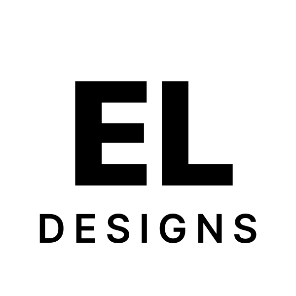

    

        
    

     
    <h1>Emily Lim</h1>
    
Bcom Student at McGill University.

<h2>Table of Contents</h2>

- [Project Description](#project-description)
- [Hosting](#hosting)
- [License](#license)

## Project Description
Personal portfolio website made using TypeScript, Next.js, and TailwindCSS.

## Hosting
This project is hosted on [Vercel](https://vercel.com/), you can access it by at: [https://emilylim.vercel.app/](https://emilylim.vercel.app/).

## License
This project make use of the GNU General Public License v3.0. To learn more about this license, click [here](LICENSE.md).